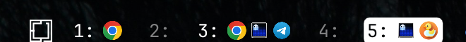

# Workspaces with Window Icons

An [Omarchy](https://omarchy.org/) shell bar widget — a fork of the built-in
`omarchy.workspaces` widget that also shows the icon of each running window
next to its workspace number. Click an icon to switch to that window's
workspace.

This is schotime's fork of
[deda/omarchy-workspaces-icons](https://github.com/deda/omarchy-workspaces-icons),
adding per-monitor workspaces and program icons for terminals.



## Install

```bash
omarchy plugin add https://github.com/schotime/omarchy-workspaces-icons.git --enable
omarchy plugin disable omarchy.workspaces
```

## Manual install

```bash
git clone https://github.com/schotime/omarchy-workspaces-icons.git ~/.config/omarchy/plugins/deda.workspaces-icons
omarchy plugin enable deda.workspaces-icons
omarchy plugin disable omarchy.workspaces
```

## Settings

Set these on the widget's entry in `~/.config/omarchy/shell.json`:

```json
{ "id": "deda.workspaces-icons", "mode": "shared", "workspacesPerMonitor": 10 }
```

- `mode`
  - `"blocks"` (default): each monitor owns its own block of workspace ids
    (1-10, 11-20, ...). Each bar shows its monitor's block, labelled 1-9, 0.
  - `"shared"`: all monitors share workspaces 1-10, as stock Omarchy does.
    Each bar shows the workspaces on its own monitor under their real numbers,
    plus any of the first five that aren't open anywhere yet.
- `workspacesPerMonitor` (default `10`): the size of a block in `"blocks"`
  mode, or the highest workspace shown in `"shared"` mode.

## Update

```bash
omarchy plugin update deda.workspaces-icons
```

## Remove

```bash
omarchy plugin remove deda.workspaces-icons
```

## License

[MIT](LICENSE)
